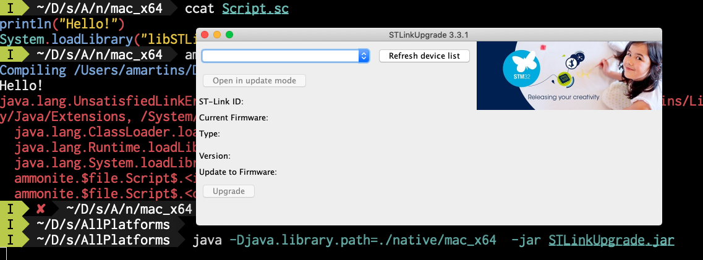

# The board

The processor `STM32L031K6T6`

- Installing CubeMX
- installing openocd with `brew install [--HEAD] openocd`
  - http://openocd.org/
- since I am on the MAC, I ended up installing `brew install arm-none-eabi-llvm` instead of the `gcc-arm-none-eabi` Monica and I installed on Windows.
- lets see if this works out ok.

**20191012**

# Install on my Mac OSX Mojave

1- stlik reflash
2- segger development suite -> quickly done.

## stlik reflash

This is a Windows only application. So I am going to try and use 'STSW-LINK007' which is a jar with a native part for Windows, Mac and Linux .

When running it for the first time
```fish
tree -L 3 .
.
├── STLinkUpgrade.jar
├── StlinkRulesFilesForLinux
│   ├── 49-stlinkv1.rules
│   ├── 49-stlinkv2-1.rules
│   ├── 49-stlinkv2.rules
│   ├── 49-stlinkv3.rules
│   └── Readme.txt
└── native
    ├── linux_x64
    │   └── libSTLinkUSBDriver.so
    ├── linux_x86
    │   └── libSTLinkUSBDriver.so
    ├── mac_x64
    │   └── libSTLinkUSBDriver.dylib
    ├── win_x64
    │   └── STLinkUSBDriver.dll
    └── win_x86
        └── STLinkUSBDriver.dll

7 directories, 11 files
```

I run it:
```fish
chmod +x native/*
java -jar STLinkUpgrade.jar
```
and got the following errors:
```java
Exception in thread "main" java.lang.UnsatisfiedLinkError: /Users/amartins/Downloads/stsw-link007/AllPlatforms/native/mac_x64/libSTLinkUSBDriver.dylib: dlopen(/Users/amartins/Downloads/stsw-link007/AllPlatforms/native/mac_x64/libSTLinkUSBDriver.dylib, 1): Library not loaded: /opt/local/lib/libusb-1.0.0.dylib
  Referenced from: /Users/amartins/Downloads/stsw-link007/AllPlatforms/native/mac_x64/libSTLinkUSBDriver.dylib
  Reason: image not found
        at java.base/java.lang.ClassLoader$NativeLibrary.load0(Native Method)
        at java.base/java.lang.ClassLoader$NativeLibrary.load(ClassLoader.java:2430)
        at java.base/java.lang.ClassLoader$NativeLibrary.loadLibrary(ClassLoader.java:2487)
        at java.base/java.lang.ClassLoader.loadLibrary0(ClassLoader.java:2684)
        at java.base/java.lang.ClassLoader.loadLibrary(ClassLoader.java:2617)
        at java.base/java.lang.Runtime.load0(Runtime.java:767)
        at java.base/java.lang.System.load(System.java:1831)
        at com.st.stlinkinterface.e.a(SourceFile:127)
        at com.st.stlinkupgrade.app.b.a(SourceFile:62)
        at com.st.stlinkupgrade.app.MainApp.main(SourceFile:16)
```

O-K. I need to, first, reproduce this in a simpler piece of code. Wrote a quick and dirty Ammonite script:

```scala
println("Hello!")
System.loadLibrary("libSTLinkUSBDriver")
```
and reproduced a similar error.
```fish
 amm Script.sc
Compiling /Users/amartins/Downloads/stsw-link007/AllPlatforms/native/mac_x64/Script.sc
Hello!
java.lang.UnsatisfiedLinkError: no libSTLinkUSBDriver in java.library.path: [/Users/amartins/Library/Java/Extensions, /Library/Java/Extensions, /Network/Library/Java/Extensions, /System/Library/Java/Extensions, /usr/lib/java, .]
  java.lang.ClassLoader.loadLibrary(ClassLoader.java:2660)
  java.lang.Runtime.loadLibrary0(Runtime.java:829)
  java.lang.System.loadLibrary(System.java:1867)
  ammonite.$file.Script$.<init>(Script.sc:2)
  ammonite.$file.Script$.<clinit>(Script.sc)
```
The error is similar enough in the sense that both the call to `ClassLoader.loadLibrary` and `ClassLoader$NativeLibrary.load0( )` failed to find the library `libSTLinkUSBDriver` in the path.


# Stackoverflow take on how to load a native library in java
https://stackoverflow.com/questions/11783632/how-do-i-load-and-use-native-library-in-java#11783657

> Do the following:
> 
> - Use System.loadLibrary("mylib");
> - Copy mylib.so to libmylib.so
> - Run java -Djava.library.path=/root/ Main

Which i did:

```fish
 java -Djava.library.path=./native/mac_x64  -jar STLinkUpgrade.jar
Exception in thread "main" java.lang.UnsatisfiedLinkError: /Users/amartins/Downloads/stsw-link007/AllPlatforms/native/mac_x64/libSTLinkUSBDriver.dylib: dlopen(/Users/amartins/Downloads/stsw-link007/AllPlatforms/native/mac_x64/libSTLinkUSBDriver.dylib, 1): Library not loaded: /opt/local/lib/libusb-1.0.0.dylib
  Referenced from: /Users/amartins/Downloads/stsw-link007/AllPlatforms/native/mac_x64/libSTLinkUSBDriver.dylib
  Reason: image not found
        at java.base/java.lang.ClassLoader$NativeLibrary.load0(Native Method)
        at java.base/java.lang.ClassLoader$NativeLibrary.load(ClassLoader.java:2430)
        at java.base/java.lang.ClassLoader$NativeLibrary.loadLibrary(ClassLoader.java:2487)
        at java.base/java.lang.ClassLoader.loadLibrary0(ClassLoader.java:2684)
        at java.base/java.lang.ClassLoader.loadLibrary(ClassLoader.java:2617)
        at java.base/java.lang.Runtime.load0(Runtime.java:767)
        at java.base/java.lang.System.load(System.java:1831)
        at com.st.stlinkinterface.e.a(SourceFile:127)
        at com.st.stlinkupgrade.app.b.a(SourceFile:62)
        at com.st.stlinkupgrade.app.MainApp.main(SourceFile:16)
```

Notice the `Library not loaded: /opt/local/lib/libusb-1.0.0.dylib` which is a new error.

Fixed it by installing `libusb` with `brew install libusb` and, the next time, the program run:



This program allows us to flash firmware on the board with the ability to debug a program running there with J-Link (specific to Segger) and ST-Link (created by STM itself) which may be used by Clion.

Meanwhile, Mônica just flashed the board with J-Link and I can now skip this step completely.

# Create a small program and run it on the board

Starting Segger.


The refresh device button did not detect the board plug

# TODO

- [ ] try `gcc-arm-none-eabi` if `arm-none-eabi-llvm` does not work.

